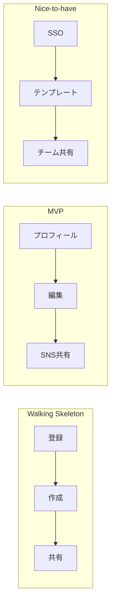

# ユーザーストーリーマッピングテンプレート

## 概要

Jeff Patton のユーザーストーリーマッピングに基づき、
MVP のスコープを「ユーザーの行動フロー」に沿って整理する。

## ストーリーマップ構造

```
時間軸 ──────────────────────────────────────────→

[アクティビティ1]    [アクティビティ2]    [アクティビティ3]    ← Backbone
    │                    │                    │
    ├── タスク1.1        ├── タスク2.1        ├── タスク3.1     ← Walking Skeleton
    │                    │                    │
    ├── タスク1.2        ├── タスク2.2        ├── タスク3.2     ← MVP Release
    ├── タスク1.3        │                    ├── タスク3.3
    │                    │                    │
    ├── タスク1.4        ├── タスク2.3        ├── タスク3.4     ← Nice-to-have
    └── タスク1.5        └── タスク2.4        └── タスク3.5
```

## 記入テンプレート

### Backbone（ユーザー活動）

ユーザーがプロダクトで行う活動を時系列で並べる:

| # | アクティビティ | ユーザーのゴール |
|---|--------------|----------------|
| A1 | | |
| A2 | | |
| A3 | | |
| A4 | | |
| A5 | | |

### タスク分解

各アクティビティを具体的なタスクに分解する:

#### A1: [アクティビティ名]

| 優先度 | タスク | ユーザーストーリー | リリース |
|--------|--------|-------------------|---------|
| 1 | | As a [ユーザー], I want to [行動], so that [価値] | Walking Skeleton |
| 2 | | | MVP |
| 3 | | | Nice-to-have |

#### A2: [アクティビティ名]

| 優先度 | タスク | ユーザーストーリー | リリース |
|--------|--------|-------------------|---------|
| 1 | | | Walking Skeleton |
| 2 | | | MVP |
| 3 | | | Nice-to-have |

### リリース計画

#### Walking Skeleton（最初のスプリント）
- 目的: エンドツーエンドで動く最小構成を作る
- 含むタスク: 各アクティビティの優先度1のタスクのみ
- 完了基準: ユーザーが一通りの流れを体験できる

#### MVP Release（初回リリース）
- 目的: 最初のユーザーに価値を提供する
- 含むタスク: Walking Skeleton + 優先度2のタスク
- 完了基準: PMF テストが実施できる状態

#### Nice-to-have（MVP後）
- 目的: フィードバックに基づく機能追加
- 含むタスク: 優先度3以降のタスク
- 優先順位: ユーザーフィードバックで決定

## スコープ判断基準

タスクを MVP に含めるかの判断:

| 質問 | Yes → MVP | No → Nice-to-have |
|------|-----------|-------------------|
| これがないとユーザーは課題を解決できないか？ | MVP | Nice-to-have |
| 初回ユーザーがこれを期待するか？ | MVP | Nice-to-have |
| これがないと競合に勝てないか？ | MVP | Nice-to-have |
| 1週間以内に実装できるか？ | MVP | 要検討 |

## Mermaid 出力例


