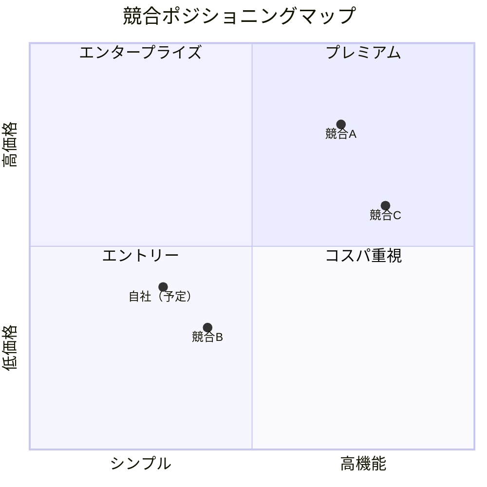

# market-research: 市場調査

## 概要

アイデアの競合分析と市場規模の概算を行い、`docs/market-research.md` を生成します。

## このスキルの制限事項（ユーザーへの告知必須）

以下のサービスは SPA 構造のため WebFetch での分析が困難です:
- Product Hunt / App Store / Google Play / Twitter(X)

このスキルが提供できるもの:
- ✅ 競合サービスの **公式サイト** から取得できる情報（料金・機能・ポジション）
- ✅ ユーザーのヒアリング回答に基づいた分析
- ⚠️ 市場規模（TAM/SAM/SOM）は LLM の知識ベースに基づく **参考推定値**

より精度の高い調査には以下を並用することを推奨:
- [SimilarWeb](https://similarweb.com)（流入分析）
- [Google Trends](https://trends.google.com)（検索トレンド）

## ワークフロー

### Step 1: 競合サービスのヒアリング

```
以下を教えてください：
1. 競合または参考にしているサービスを3つ挙げてください
   （例: Notion, Airtable, Coda）
2. それらのどの点が不満ですか？
3. あなたのサービスとの差別化ポイントは何ですか？
```

注意: Product Hunt・App Store は SPA のため WebFetch では取得困難。
ユーザーのヒアリング回答に基づいて分析を進める。

### Step 1.5: トレンドスキャン（WebSearch）

`references/search-strategy.md` の4カテゴリに従い、WebSearch で市場トレンドを調査する。

- 各カテゴリにつき英語・日本語で検索を実行
- `{current_year}` は実行時の西暦に置換する
- WebSearch の `allowed_domains` パラメータを活用し、信頼性の高いソースを優先する（`site:` 構文ではなくツールのパラメータを使う）
- 検索結果は Step 3（差別化分析）に反映する

### Step 2: 競合サービス分析

ユーザーから収集した競合サービスの**公式サイト**を WebFetch で取得・分析:

```
各競合サービスについて:
- 主要機能
- 料金プラン
- ターゲットユーザー
- 強み・弱み
```

### Step 3: 差別化分析

競合との比較表を作成:

| 機能 | 競合A | 競合B | 競合C | 自社 |
|------|-------|-------|-------|------|
| [機能1] | ✅/❌ | ✅/❌ | ✅/❌ | ✅ |

### Step 4: 市場規模の概算

- 対象ユーザー規模の推定
- 想定 TAM / SAM / SOM
- 収益化タイムラインの概算

### 出力

`docs/market-research.md`（競合分析レポート）

末尾に以下の免責事項を含める:

> **免責事項**: 市場規模の数値は参考推定値です。
> 重要な意思決定には一次情報（業界レポート・ユーザーインタビュー）を合わせて使用してください。

## Porter's Five Forces 分析

`references/porters-five-forces-template.md` に従い、業界の競争環境を5つの力で分析する:

1. **業界内の競争**: 既存競合の数・規模・差別化の程度
2. **新規参入の脅威**: 参入障壁の高さ（技術・資本・ネットワーク効果）
3. **代替品の脅威**: 異なるアプローチで同じジョブを解決する製品
4. **買い手の交渉力**: ユーザーのスイッチングコスト・価格感度
5. **売り手の交渉力**: 依存するプラットフォーム・API の影響力

分析結果は `docs/market-research.md` の「業界構造分析」セクションに記載する。

## TAM/SAM/SOM ボトムアップ算出

`references/tam-sam-som-calculation.md` に従い、市場規模をボトムアップで算出する:

- **TAM（Total Addressable Market）**: 理論上の最大市場規模
- **SAM（Serviceable Available Market）**: 実際にリーチ可能な市場
- **SOM（Serviceable Obtainable Market）**: 1〜2年で現実的に獲得可能な市場

Step 4 の市場規模概算で、トップダウン（業界レポート参照）とボトムアップ（単価 x 顧客数）の両方を提示する。

## 競合ポジショニングマップ

Step 3 の差別化分析に、Mermaid quadrant chart で競合ポジショニングマップを追加する:



軸の選定はプロダクト特性に応じて変更する（例: UX品質 vs 機能数、個人向け vs チーム向け）。

## 品質チェック

- [ ] 競合サービスが3社以上分析されているか
- [ ] 差別化ポイントが明確に記載されているか
- [ ] 市場規模の概算が記載されているか
- [ ] TAM/SAM/SOM がボトムアップで算出されているか
- [ ] Porter's Five Forces 分析が含まれているか
- [ ] 競合ポジショニングマップ（Mermaid）が含まれているか
- [ ] 市場規模の概算に「参考推定値」である旨の免責事項が含まれているか
- [ ] WebFetch で取得できなかった情報について代替情報源を案内したか
- [ ] 競合サービスの分析が公式サイトの事実に基づいているか（憶測でないか）
